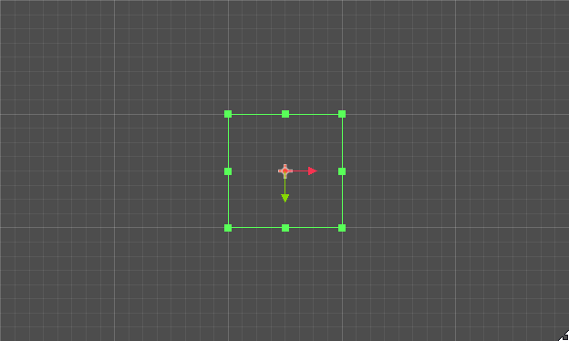
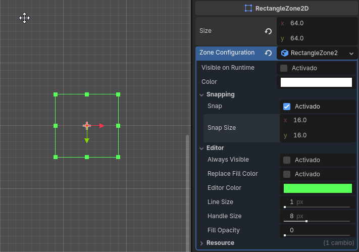
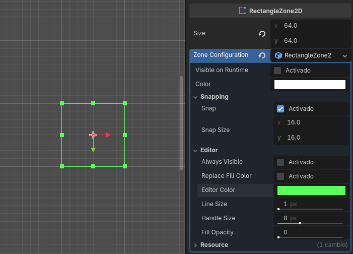
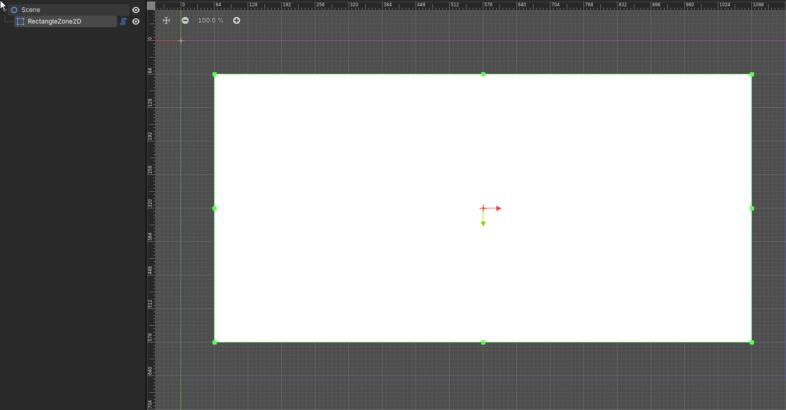

# EditorShapes
This is a small plugin for Godot 4.X that allows you to define shapes in the editor that can be used for drawing or logic purposes. The main advantage of this plugin is that every node in Godot that allows you to define a shape and edit it by dragging its handles is either a physics based node or a `Control` node that doesn't inherit from the `Node2D` hierarchy.

> [!warning]
> This is a very early version of the plugin. Althought it works well and it has been tested, expect breaking changes in any yet-to-come update.
> Any of those breaking changes will be listed in the change log.

# Features
### Works exactly the same as a built-in editable shape
The plugin allows you to drag and drop the shape from each corner and side. Pressing alt will make it extend in both directions. Pressing control/command will make it a square.

  

### Snap to grid, customizable for each node
Set the size of the snap grid for each node, or share the same configuration throughout different nodes by using a shared resource.

  

### Customize the editor colors, and make the shape visible during runtime
You can set custom colors for the shape's outline and handles in the editor. You can also set the shape to be visible during runtime, so it will work as a `ColorRect`, but with `Node2D` inheritance.

  

### Create masks
Set a mask that will turn the shape invisible in the defined area. A mask node doesn't necessarily need to be placed as a child of the masked node, it can be anywhere in the scene tree.

  

# How to use
The plugin is extremely easy and straight-forward to use. To define a shape, simply add a `RectangleZone2D` node into your scene.

### Customization
- Add a resource in the `Zone Configuration` property. If no resource is set, the node will work perfectly with a default configuration.
- To make it visible during runtime, set the `Visible on Runtime` property to true. You can change the `Color` property too.
- If you set the `Always Visible` property to true, the outline of the shape will visible in the editor always, even if you don't have this node or a direct parent selected.
- You can tweak all the other values for setting up the snapping and editor visiblity properties.

### Masking
- Add a `RectangleMaskZone2D` node into your scene.
- If you make it a direct child of a `RectangleZone2D` node, it will mask that node.
- If you set one or more `RectangleZone2D` nodes in the `Masked Zones` array, it will mask those shapes nodes instead.

# FAQ
#### Can I undo / redo my changes?
Yes, this plugin uses the undo / redo system, so any change that you make to the shape will be registered properly.
#### Will you expand this plugin to support other shapes?
Yes, I will add support for circle shapes. As for polygon shapes, I might find a way to add masking support using the already existing `Polygon2D` node.
#### I added a mask but it's not visible in the editor:
Unfortunately, adding masks dinyamically is still a feature that I want to add, but didn't have time to implement it. Same goes for adding or modifying masks during runtime.